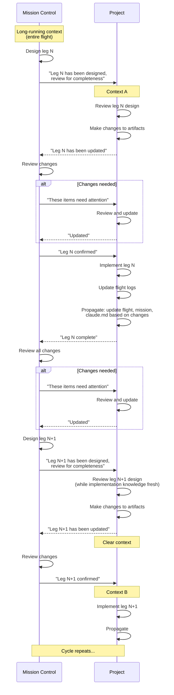

# Flight Control

An AI-first software development lifecycle methodology using aviation metaphors to bridge human intent and AI execution.

## What is Mission Control?

This repository is a **centralized command center** for managing multiple projects in parallel. Each project may have its own stack, systems, and constraints, but mission-control provides a consistent workflow and orchestration layer across all of them.

- **Project registry** — Track active projects with paths, remotes, and configurations
- **Shared methodology** — Apply structured planning regardless of project differences
- **Claude Code skills** — Interactive tools for mission, flight, and leg creation

Artifacts (missions, flights, legs) are created in target projects, not here. Mission-control holds the methodology, skills, and coordination—your projects hold the work.

Development crews remain essential. AI can automate much of the implementation, but technical oversight ensures quality and alignment with intent.

## The Aviation Model

Flight Control organizes work into three hierarchical levels, each optimized for its primary audience:

```
Mission (human-optimized)
  └── Flight (balanced)
        └── Leg (AI-optimized)
```

- **Missions** define outcomes in human terms—what success looks like and why it matters
- **Flights** translate outcomes into technical specifications with planning checklists
- **Legs** provide structured, specific instructions optimized for AI consumption

## Why Aviation?

Aviation succeeds through layered planning and clear handoffs. Pilots follow flight plans but improvise when conditions demand it—weather, emergencies, ATC instructions. Structured planning enables effective improvisation by providing a baseline to deviate from and return to. Similarly, Flight Control separates strategic intent (missions) from tactical execution (legs), with flights serving as the translation layer.

## Quick Start

1. **[Overview](docs/overview.md)** — Philosophy and principles behind Flight Control
2. **[Roles](docs/roles.md)** — Crew and Mission Control organizational structure
3. **[Missions](docs/missions.md)** — Writing outcome-driven mission statements
4. **[Flights](docs/flights.md)** — Creating technical specifications with pre/post checklists
5. **[Flight Logs](docs/flight-logs.md)** — Recording execution progress and decisions
6. **[Legs](docs/legs.md)** — Structuring AI-optimized implementation steps
7. **[Workflow](docs/workflow.md)** — End-to-end flow from mission to completion

## Core Concepts

### The Audience Gradient

Documentation becomes progressively more structured as it moves down the hierarchy:

| Level | Audience | Style |
|-------|----------|-------|
| Mission | Humans, stakeholders | Narrative prose, outcome-focused |
| Flight | Developers, AI | Technical spec with checklists |
| Leg | AI agents | Structured format, explicit criteria |

### Lifecycle States

Each level tracks progress through defined states:

- **Missions**: `planning` → `active` → `completed` (or `aborted`)
- **Flights**: `planning` → `ready` → `in-flight` → `landed` (or `diverted`)
- **Legs**: `queued` → `in-progress` → `review` → `completed` (or `blocked`)

### Roles

Flight Control scales from solo developers to full teams:

**Solo** — One person fills all roles, using AI as their crew. The methodology provides structure and continuity across sessions.

**Team** — Roles split across people:
- **Crew** executes flights (Commander + Flight Engineer, 1:1 pairing)
- **Mission Control** oversees operations (Flight Director, Ops Director, Technical Architects)

## Artifact Organization

The hierarchy nests naturally:

```
Mission
├── Mission Briefing
├── Mission Debrief
└── Flight
    ├── Flight Log
    ├── Flight Briefing
    ├── Flight Debrief
    └── Leg
```

How you store these artifacts depends on your project's needs. Flight Control supports multiple artifact systems:

- **Markdown files** — Version-controlled documentation in your repository
- **Issue trackers** — Jira, Linear, GitHub Issues with linked relationships
- **Hybrid** — Missions in markdown, flights/legs as tickets

Each project configures its artifact system during initialization. The methodology and Claude Code skills adapt to your choice.

## Claude Code Skills

Flight Control includes Claude Code skills for interactive planning:

| Skill | Purpose |
|-------|---------|
| `/init-project` | Initialize a project for Flight Control |
| `/mission` | Create outcome-driven missions through research and interview |
| `/flight` | Create technical flight specs from missions |
| `/leg` | Generate implementation guidance for LLM execution |
| `/flight-debrief` | Post-flight analysis for continuous improvement |
| `/mission-debrief` | Post-mission retrospective for outcomes assessment |

## Recommended Workflow

Flight Control operates across two Claude sessions: **Mission Control** (planning and orchestration) and **Project** (implementation and review).

### Context Strategy

- **Mission Control**: Long-running session spanning an entire flight—accumulates knowledge across legs
- **Project**: Fresh session per leg—relies on artifacts to carry forward knowledge

Review the next leg's design *before* clearing context, while implementation knowledge is fresh. Implement in a clean context.

### The Cycle



### Why This Matters

Implementation reveals reality. Without propagating that knowledge back into artifacts:
- The next project session starts with stale assumptions
- Mission Control's long-running context drifts from the code
- Each leg operates on increasingly outdated plans

The discipline of review-before-clear and propagate-before-complete keeps artifacts synchronized with truth.

## License

[AGPL-3.0](LICENSE)
