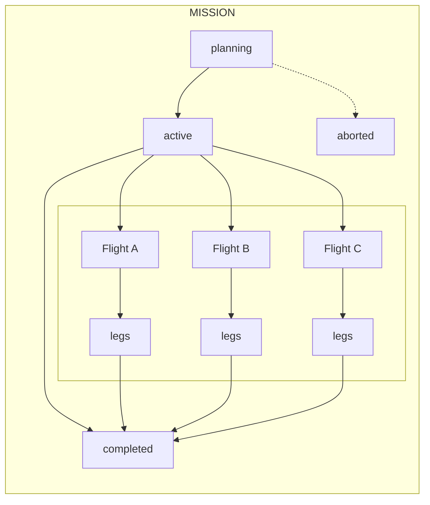

# Workflow

This document describes how work flows through Flight Control from mission inception to completion.

## The Complete Flow



## Phase 1: Mission Definition

### Starting Point

Work begins with an outcome someone wants to achieve:

> "We need users to be able to authenticate securely"

This human need becomes a mission.

### Mission Creation

1. **Write the outcome** — What does success look like?
2. **Define success criteria** — How will we know we're done?
3. **Identify stakeholders** — Who cares about this outcome?
4. **Document constraints** — What boundaries exist?

```markdown
# Mission: Secure User Authentication

## Outcome
Users can securely access their accounts without credential friction.

## Success Criteria
- [ ] Users can create accounts
- [ ] Users can log in and maintain sessions
- [ ] Password reset flow exists
- [ ] Security audit passes

## Stakeholders
- End users, Security team, Support team

## Constraints
- Must complete before Q2 launch
- Must meet SOC2 requirements
```

### Mission State: `planning`

The mission exists but no work has started. This is the time for:
- Refining the outcome statement
- Adjusting success criteria
- Identifying initial flights

## Phase 2: Flight Planning

### Decomposing the Mission

A mission typically requires multiple flights. Identify the major work areas:

```
Mission: Secure User Authentication
├── Flight: Account Creation
├── Flight: Login and Sessions
├── Flight: Password Reset
└── Flight: Security Hardening
```

### Creating the First Flight

Start with the flight that unblocks others or provides the most learning:

```markdown
# Flight: Account Creation

## Mission Link
[Secure User Authentication](../mission.md)
- Contributing to: "Users can create accounts"

## Pre-Flight

### Objective
Users can register new accounts with email and password.

### Open Questions
- [ ] What password requirements?
- [ ] Email verification required before use?

### Design Decisions
(To be filled as questions are resolved)

### Prerequisites
- [ ] Database provisioned
- [ ] API framework set up
```

### Flight State: `planning`

Pre-flight phase. Resolve open questions, document decisions, verify prerequisites.

## Phase 3: Pre-Flight Completion

### Resolving Questions

Each open question gets answered and documented:

```markdown
### Open Questions
- [x] What password requirements?
- [x] Email verification required before use?

### Design Decisions

**Password Requirements**: Minimum 8 characters, 1 uppercase, 1 number
- Rationale: Balance security and usability
- Decided by: Security team

**Email Verification**: Required before accessing protected features
- Rationale: Prevent spam accounts
- Decided by: Product requirements
```

### Defining Legs

With decisions made, break the flight into legs:

```markdown
### Legs
- [ ] `create-user-model` - Database model for users
- [ ] `registration-endpoint` - API endpoint for registration
- [ ] `email-verification` - Verification email and confirmation flow
- [ ] `registration-tests` - Test coverage for registration
```

### Pre-Flight Checklist

Complete the gate check:

```markdown
### Pre-Flight Checklist
- [x] All open questions resolved
- [x] Design decisions documented
- [x] Prerequisites verified
- [x] Legs defined with acceptance criteria
```

### Flight State: `ready`

Pre-flight complete. Ready for execution.

## Phase 4: Leg Execution

### Mission State: `active`

When the first leg begins, the mission becomes active.

### Flight State: `in-flight`

Legs are being executed. A [flight log](flight-logs.md) tracks progress, recording when legs start and complete, decisions made during execution, and any deviations or anomalies encountered.

### Leg Lifecycle

Each leg follows its own progression:

```
queued ──► in-progress ──► review ──► completed
```

**Example: `create-user-model` leg**

```markdown
# Leg: create-user-model

## Objective
Create the User model with authentication fields.

## Acceptance Criteria
- [ ] User model in schema
- [ ] Fields: id, email, password_hash, verified, timestamps
- [ ] Migration applied
- [ ] Types generated
```

**Execution flow:**

1. Leg moves to `in-progress`, recorded in flight log
2. AI executes the implementation
3. AI reports completion, leg moves to `review`
4. Verification confirms acceptance criteria met
5. Leg moves to `completed`, flight log updated with summary of changes

### Parallel vs. Sequential Legs

Some legs can run in parallel:

```
create-user-model ────► registration-endpoint ────► registration-tests
                  └──► email-verification ────────┘
```

The model must exist first, but the endpoint and email flows can be built simultaneously, then tests cover everything.

### Handling Blocked Legs

When a leg can't proceed:

1. Mark it `blocked` with explanation
2. Determine if it needs:
   - Flight-level decision (update the flight)
   - External resolution (wait for dependency)
   - Leg redesign (create new leg)

```markdown
## Status: blocked

**Blocker**: Email service credentials not available in dev environment
**Needs**: DevOps to provision SendGrid API key
**Impact**: Cannot test email verification flow
```

## Phase 5: Flight Completion

### All Legs Complete

When every leg reaches `completed`:

```markdown
### Legs
- [x] `create-user-model` - completed
- [x] `registration-endpoint` - completed
- [x] `email-verification` - completed
- [x] `registration-tests` - completed
```

### Post-Flight Checklist

```markdown
### Completion Checklist
- [x] All legs completed
- [x] Code merged to main
- [x] Tests passing in CI
- [x] Documentation updated
```

### Verification

Confirm the flight achieved its objective:

```markdown
### Verification

Manual test completed:
1. ✓ Created account with test@example.com
2. ✓ Received verification email
3. ✓ Clicked link, account verified
4. ✓ Can access protected features
```

### Retrospective

Capture learnings:

```markdown
### Retrospective Notes

**What went well:**
- Email verification leg was well-specified
- No blockers during execution

**What could improve:**
- Password validation rules should have been a separate leg
- Underestimated email template complexity
```

### Flight State: `landed`

Post-flight complete. The flight achieved its objective.

## Phase 6: Mission Progression

### Tracking Mission Progress

As flights land, mission success criteria get checked:

```markdown
## Success Criteria
- [x] Users can create accounts ← Flight: Account Creation landed
- [ ] Users can log in and maintain sessions ← Flight: Login in-flight
- [ ] Password reset flow exists ← Flight: Password Reset planning
- [ ] Security audit passes ← Flight: Security Hardening queued
```

### Spawning New Flights

Discoveries during execution may require new flights:

> "During the Login flight, we discovered we need rate limiting to prevent brute force attacks."

Create a new flight:

```
Mission: Secure User Authentication
├── Flight: Account Creation [landed]
├── Flight: Login and Sessions [in-flight]
├── Flight: Password Reset [planning]
├── Flight: Security Hardening [planning]
└── Flight: Rate Limiting [NEW - planning]
```

### Mission Completion

When all success criteria are met:

```markdown
## Success Criteria
- [x] Users can create accounts
- [x] Users can log in and maintain sessions
- [x] Password reset flow exists
- [x] Security audit passes
```

### Mission State: `completed`

All outcomes achieved. The mission can be archived.

## Feedback Loops

### Upward Feedback

Information flows from legs to flights to missions:

- **Leg → Flight**: Completion status, discovered complexity, blockers (captured in flight log)
- **Flight → Mission**: Progress on success criteria, new flight needs

### Downward Feedback

Guidance flows from missions to flights to legs:

- **Mission → Flight**: Priority changes, constraint updates
- **Flight → Leg**: Design decisions, context updates, flight log history

### Adaptation

When circumstances change:

1. **Leg-level**: Block the leg, create new leg
2. **Flight-level**: Divert the flight, re-plan
3. **Mission-level**: Adjust success criteria or abort

## Handling Diversions

### When to Divert vs. Create New Flight

**Divert the current flight when:**
- The objective remains the same but the approach must change
- External factors (security issues, API changes) invalidate the current plan
- Discovered complexity requires re-planning but the goal is unchanged

**Create a new flight when:**
- A completely new objective emerges
- The discovered work is independent of the current flight's goal
- The new work serves different mission success criteria

### Flight Diversion

When a flight must change direction:

```markdown
## Status: diverted

**Reason**: Security audit revealed JWT vulnerability
**Original plan**: Custom JWT implementation
**New direction**: Use established auth library (Auth0)

## Impact
- Legs `jwt-generation` and `jwt-validation` deprecated
- New legs for Auth0 integration created
```

The flight returns to `planning` to redefine the approach, then proceeds through `ready` → `in-flight` → `landed`.

### Mission Abortion

Sometimes missions should be cancelled:

```markdown
## Status: aborted

**Reason**: Business pivot - authentication now handled by parent company SSO
**Learning**: Coordinate with enterprise architecture earlier
**Artifacts**: Account creation flight code preserved in branch for reference
```

Document the reason for future reference.

## State Summary

### All States in One View

```
MISSION STATES
planning ──► active ──► completed
                │
                └──► aborted

FLIGHT STATES
planning ──► ready ──► in-flight ──► landed
                           │
                           └──► diverted ──► planning

LEG STATES
queued ──► in-progress ──► review ──► completed
                │
                └──► blocked ──► queued
```

## When to Create vs. Modify

### Create New

- **Mission**: New outcome needed
- **Flight**: New area of work identified
- **Leg**: Requirements changed after `in-progress`

### Modify Existing

- **Mission**: Refining success criteria during `planning`
- **Flight**: Updating during `planning` phase
- **Leg**: Only while `queued` (before work begins)

### Rule of Thumb

Once work begins, create new rather than modify. This preserves history and prevents confusion about what was actually requested.

## Quick Reference

| Phase | Mission State | Flight State | Leg State |
|-------|---------------|--------------|-----------|
| Defining outcomes | planning | — | — |
| Planning first flight | planning | planning | — |
| Pre-flight complete | planning | ready | queued |
| Executing first leg | active | in-flight | in-progress |
| Leg verification | active | in-flight | review |
| Leg done | active | in-flight | completed |
| Flight done | active | landed | — |
| All flights done | completed | — | — |
